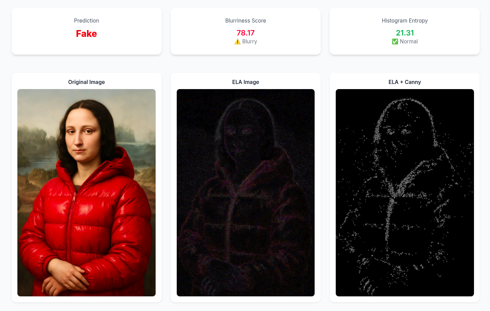
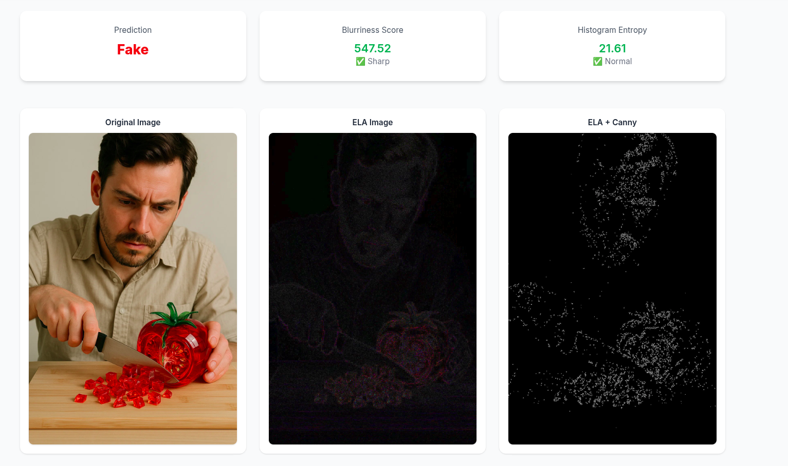

# Image Authentication Detection

This is a Django-based project for detecting image authenticationn using deep learning. It includes a trained model (`.keras`) and a frontend for uploading and analyzing images.

---

## Requirements

- Python **3.11.5**
- [`uv`](https://lithic.dev/docs/uv/intro) package manager (alternative to pip)

---

## 🔧 Installation & Running the Project

1. **Clone the repository**
```bash
   git clone https://github.com/elly-hacen/ImageAuth.git
   cd ImageAuth
````

2. **Install dependencies with `uv`**

```bash
uv sync
```

3. **Run the Django development server**

```bash
uv run manage.py runserver
```

4. **Open your browser** and go to:
   `http://127.0.0.1:8000/`

---

## Site Images






